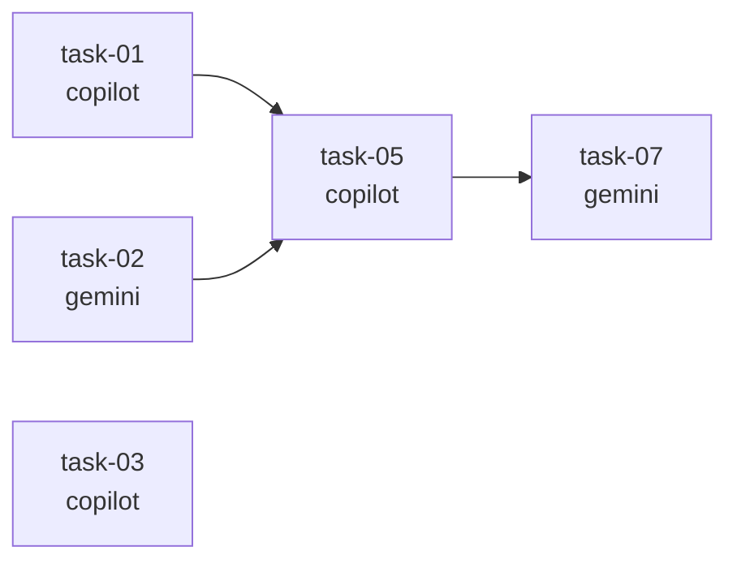

# Task: Design Task DAG Visualization Algorithm

## Objective
Design the algorithm and ASCII/Mermaid output format for `bin/task-dag.sh` — a tool that reads task spec files from a batch directory and renders a dependency graph (DAG) showing task ordering, parallelism, and critical path.

## Context
The orchestration system is at `/Users/hodtien/claude-orchestration/`.

Task specs are YAML-frontmatter markdown files in `.orchestration/tasks/<batch-id>/task-*.md`.
Key frontmatter fields relevant to the DAG:
- `id` — unique task identifier
- `agent` — copilot | gemini
- `depends_on` — list of task IDs that must complete first
- `priority` — high | normal | low
- `context_from` — list of task IDs whose output is injected (informational dependency)

Example batch with dependencies:
```
task-01 (copilot, no deps)  → task-03 (copilot, depends_on: [task-01, task-02])
task-02 (gemini, no deps)   ↗
```

Existing helper: `bin/task-dispatch.sh` already has a Python cycle-detection DFS. The DAG viz tool will read the same spec format.

## Design Requirements

Design both output formats:

### 1. ASCII DAG (default)
Something like:
```
Batch: phase1  (7 tasks)
══════════════════════════════════════════
[copilot] task-01 ──┐
[gemini]  task-02 ──┼──► [copilot] task-05 ──► [gemini] task-07
[copilot] task-03 ──┘
[copilot] task-04 (isolated)
══════════════════════════════════════════
Critical path: task-02 → task-05 → task-07  (3 hops)
Parallel groups: {task-01, task-02, task-03, task-04}  {task-05}  {task-07}
```

### 2. Mermaid format (--mermaid flag)


## What to Design

1. **Algorithm**: How to compute topological order, parallel groups (tasks with same depth level), critical path (longest chain by hop count)
2. **ASCII rendering strategy**: How to draw arrows between tasks across columns using simple characters
3. **CLI interface**: `task-dag.sh <batch-dir> [--mermaid] [--critical-path]`
4. **Data structure**: What Python data structures to use (adjacency list, level map, etc.)
5. **Edge cases**: Isolated tasks (no deps, no dependents), cycles (should detect and warn), missing dep IDs

## Expected Output
A detailed design document (not code) covering:
- Algorithm pseudocode for topological sort + level grouping + critical path
- ASCII rendering approach with a worked example
- Mermaid template
- CLI interface definition
- Data structures to use in Python implementation

This output will be fed to copilot for implementation.
