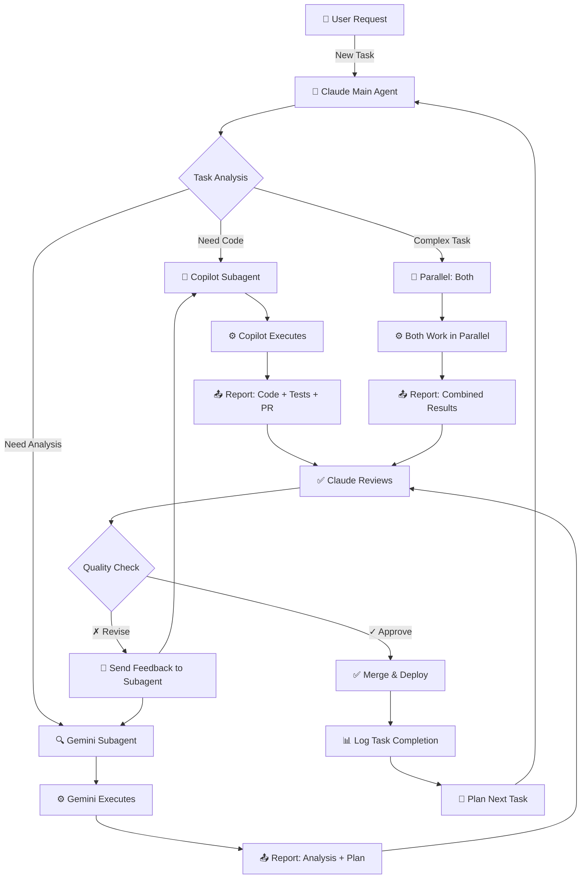

# Claude Multi-Agent Orchestration Framework
## Claude là Main Agent + GitHub Copilot CLI & Gemini CLI là Subagents

Kiến trúc multi-agent nâng cao: **Claude** (Orchestrator/Main Agent) điều phối công việc cho các subagent chuyên biệt (**Gemini CLI** và **GitHub Copilot CLI**), review kết quả, và phân phối công việc tiếp theo.

---

## Kiến Trúc Hệ Thống

```
┌────────────────────────────────────────────────────────────────────┐
│                      CLAUDE (Main Orchestrator)                    │
│  • Nhận task từ user                                              │
│  • Phân tích & lập kế hoạch                                       │
│  • Giao task cho subagent thích hợp                               │
│  • Review kết quả từ subagent                                     │
│  • Phân phối công việc tiếp theo                                  │
│  • Tổng hợp output cuối cùng                                     │
└────────────────────────────────────────────────────────────────────┘
           ↓ MCP Protocol (Delegate Task)         ↓ MCP Protocol
     ┌──────────────────────┐           ┌──────────────────────┐
     │   GEMINI CLI         │           │  COPILOT CLI         │
     │   (Subagent A)       │           │  (Subagent B)        │
     ├──────────────────────┤           ├──────────────────────┤
     │ • Research & Analysis│           │ • Code Implementation│
     │ • Design Thinking    │           │ • Debugging          │
     │ • Testing Strategy   │           │ • Code Review        │
     │ • Long context (1M)  │           │ • GitHub Integration │
     └──────────────────────┘           └──────────────────────┘
           ↓ Report Result                  ↓ Report Result
     ┌──────────────────────┐           ┌──────────────────────┐
     │ Findings & Plan      │           │ Code Changes & Tests │
     │ (Markdown Report)    │           │ (Formatted Output)   │
     └──────────────────────┘           └──────────────────────┘
              ↓                               ↓
              └───────────────┬───────────────┘
                              ↓
                    Claude Review & Synthesize
                    → Output Final Result
                    → Decide Next Steps
```

---

## 1. MCP Copilot Server (Claude → GitHub Copilot CLI Subagent)

### Cài đặt cho Claude Desktop/Code

```bash
# Cách 1: Sử dụng claude mcp command
claude mcp add copilot -- npx -y @leonardommello/copilot-mcp-server

# Cách 2: Cấu hình thủ công
# Chỉnh sửa file: ~/.claude/claude_desktop_config.json
```

### Cấu hình JSON

```json
{
  "mcpServers": {
    "copilot": {
      "command": "npx",
      "args": ["-y", "@leonardommello/copilot-mcp-server"]
    }
  }
}
```

### Yêu cầu
- ✅ GitHub Copilot CLI installed (`copilot` command có sẵn)
- ✅ Subscription GitHub Copilot aktif
- ✅ Node.js 20+
- ✅ npx có sẵn

### Vai Trò của Copilot CLI Subagent
Copilot CLI là **Code Implementation Subagent**, chuyên về:
- ✅ Viết code từ requirements
- ✅ Fix bugs & debugging
- ✅ Code review & refactoring
- ✅ Test generation
- ✅ GitHub integration (repos, PRs, issues)
- ✅ Multi-file edits

### Orchestration Flow - Copilot Subagent

```
Claude (Main): "Implement user authentication in /auth module"
  ↓
Claude Creates Task:
  {
    task_id: "task-001",
    subagent: "copilot",
    type: "code_implementation",
    requirements: "OAuth 2.0 login with JWT tokens...",
    context: "Project structure, current auth setup...",
    deadline: "2 hours"
  }
↓
Copilot CLI (Subagent):
  • Analyzes requirements
  • Checks existing code
  • Generates implementation
  • Writes tests
  • Creates PR
↓
Copilot Reports Back:
  {
    task_id: "task-001",
    status: "completed",
    deliverables: {
      files_modified: ["auth.ts", "auth.test.ts"],
      pr_url: "github.com/org/repo/pull/123",
      test_results: "12 passed, 0 failed",
      notes: "Implemented OAuth 2.0 flow with JWT validation"
    }
  }
↓
Claude Reviews:
  ✓ Validates implementation
  ✓ Checks test coverage
  ✓ Reviews code quality
  → Approve & merge PR
  → Assign next task (e.g., "Implement API rate limiting")
```

---

## 2. MCP Gemini CLI Server (Claude → Gemini CLI Subagent)

### Setup Gemini CLI với MCP

**File config:** `~/.gemini/settings.json`

```json
{
  "mcpServers": {
    "discuss_with_copilot": {
      "command": "node",
      "args": ["./mcp_copilot_cli.js"]
    }
  }
}
```

### Vai Trò của Gemini CLI Subagent
Gemini CLI là **Research & Analysis Subagent**, chuyên về:
- ✅ Tìm hiểu requirements (1M token context)
- ✅ Phân tích code & architecture
- ✅ Planning & design thinking
- ✅ Testing strategy & QA
- ✅ Security review & compliance
- ✅ Documentation

### Orchestration Flow - Gemini Subagent

```
Claude (Main): "Analyze the legacy codebase and create migration plan"
  ↓
Claude Creates Task:
  {
    task_id: "task-002",
    subagent: "gemini",
    type: "analysis_planning",
    requirements: {
      codebase_path: "/src/**/*.ts",
      focus: "Identify technical debt & scalability issues",
      output: "Detailed migration plan with phases"
    },
    context: "Company goal: migrate to microservices in 6 months"
  }
↓
Gemini CLI (Subagent):
  • Reads entire codebase (1M tokens available)
  • Identifies patterns & anti-patterns
  • Maps dependencies
  • Analyzes test coverage
  • Creates migration roadmap
  • Generates RFC document
↓
Gemini Reports Back:
  {
    task_id: "task-002",
    status: "completed",
    deliverables: {
      analysis_report: "markdown with 50+ insights",
      migration_phases: [
        {
          phase: 1,
          duration: "2 weeks",
          tasks: ["Extract auth service", "Create API gateway"],
          risks: ["Database lock contention", "Cache invalidation"]
        },
        ...
      ],
      tech_debt: "Identified 15 critical issues",
      estimated_effort: "800 person-hours"
    }
  }
↓
Claude Reviews:
  ✓ Validates analysis quality
  ✓ Checks feasibility of plan
  ✓ Shares findings with team
  → Approve migration plan
  → Delegate Phase 1 tasks to Copilot subagent
```

### Tạo MCP Server cho Gemini (mcp_gemini_cli.js)

```javascript
import { Server } from "@modelcontextprotocol/sdk/server/index.js";
import { StdioServerTransport } from "@modelcontextprotocol/sdk/server/stdio.js";
import { exec } from "util";
import { promisify } from "util";

const execAsync = promisify(exec);

const server = new Server({
  name: "gemini-analysis-mcp",
  version: "1.0.0",
});

// Tool 1: Delegate Analysis Task to Gemini
const analysisTool = {
  name: "delegate_analysis_task",
  description: "Gửi analysis/research task tới Gemini CLI",
  schema: {
    type: "object",
    properties: {
      task: {
        type: "string",
        description: "Analysis task description",
      },
      context: {
        type: "string",
        description: "Codebase context & files to analyze",
      },
      output_format: {
        type: "string",
        enum: ["report", "plan", "summary"],
        description: "Format kết quả mong muốn",
      },
    },
    required: ["task"],
  },
  func: async (params) => {
    try {
      const { task, context = "", output_format = "report" } = params;

      const prompt = [
        `You are Gemini CLI (Subagent for Research & Analysis).`,
        `Task: ${task}`,
        `Context: ${context || "No additional context provided"}`,
        `Output format: ${output_format}`,
        ``,
        `Provide detailed analysis with:`,
        `1. Findings (key insights)`,
        `2. Risks & Challenges`,
        `3. Recommendations`,
        `4. Timeline (if applicable)`,
        `5. Next Steps`,
      ].join("\n");

      const { stdout } = await execAsync(
        `gemini -p "${prompt.replace(/"/g, '\\"')}" --model gemini-pro`
      );

      return {
        content: [
          {
            type: "text",
            text: JSON.stringify({
              status: "completed",
              task_id: params.task.substring(0, 8),
              analysis: stdout,
              timestamp: new Date().toISOString(),
            }, null, 2),
          },
        ],
        isError: false,
      };
    } catch (err) {
      return {
        content: [
          {
            type: "text",
            text: `Gemini CLI error: ${err.message}`,
          },
        ],
        isError: true,
      };
    }
  },
};

// Tool 2: Get Task Status
const statusTool = {
  name: "get_gemini_task_status",
  description: "Kiểm tra status của analysis task",
  schema: {
    type: "object",
    properties: {
      task_id: {
        type: "string",
        description: "Task ID",
      },
    },
    required: ["task_id"],
  },
  func: async (params) => {
    return {
      content: [
        {
          type: "text",
          text: JSON.stringify({
            task_id: params.task_id,
            status: "in_progress",
            progress: "75%",
            eta: "5 minutes",
          }, null, 2),
        },
      ],
      isError: false,
    };
  },
};

server.registerTool(analysisTool.name, analysisTool.schema, analysisTool.func);
server.registerTool(statusTool.name, statusTool.schema, statusTool.func);

const transport = new StdioServerTransport();
await server.connect(transport);
```

### Cách sử dụng Gemini CLI với Copilot MCP

```bash
# Liệt kê MCP servers
gemini /mcp list

# Sử dụng discuss_with_copilot tool
gemini "Ask Copilot to explain this code: function add(a, b) { return a + b; }"

# Gemini sẽ tự động gọi Copilot MCP → Copilot CLI → Trả kết quả
```

---

## 3. Claude Orchestration Engine (Main Agent Workflow)

### Quy Trình Orchestration Chính

Claude là **Main Orchestrator** - nhận user request, lập kế hoạch, giao task cho subagent thích hợp, review kết quả, và phân phối công việc tiếp theo.



### Task Distribution Strategy

Claude chọn subagent dựa trên **task type**:

| Task Type | Subagent | Rationale |
|-----------|----------|-----------|
| Code Implementation | **Copilot** | Giỏi viết code, GitHub integration |
| Code Review | **Copilot** | Native GitHub PR support |
| Bug Fixing | **Copilot** | Debugging, test generation |
| Architecture Analysis | **Gemini** | Long context (1M tokens), big picture |
| Documentation | **Gemini** | 1M context = tóm tắt codebase tốt |
| Test Planning | **Gemini** | Strategy thinking |
| Test Implementation | **Copilot** | Code generation |
| Performance Optimization | **Both** | Gemini analyzes → Copilot implements |
| Security Audit | **Gemini** | Full code review, then Copilot fixes |

### Orchestration Flow - Detailed Example

**Scenario:** Build e-commerce checkout feature

```
Step 1️⃣: User submits request
─────────────────────────────
"Build checkout flow: cart review → payment → order confirmation"

Step 2️⃣: Claude analyzes & creates project plan
─────────────────────────────
✓ Break down into tasks:
  • Phase A (Gemini): Design architecture & data schema
  • Phase B (Copilot): Implement backend endpoints
  • Phase C (Copilot): Build frontend components
  • Phase D (Gemini): Create test strategy
  • Phase E (Copilot): Implement tests & security
  • Phase F: Integration testing

Step 3️⃣: Delegate Phase A to Gemini
─────────────────────────────
Claude MCP Call:
{
  "tool": "delegate_analysis_task",
  "task_id": "phase-A-001",
  "subagent": "gemini",
  "request": "Design checkout data schema & API endpoints",
  "context": "Existing user/cart/product models",
  "deadline": "1 hour"
}

Step 4️⃣: Gemini executes (45 min)
─────────────────────────────
Gemini CLI:
  • Reads existing models (100k tokens)
  • Designs OrderSchema, CartItem, Payment models
  • Plans REST API endpoints
  • Identifies edge cases (abandoned cart, failed payment)
  • Creates RFC document

Step 5️⃣: Gemini reports back
─────────────────────────────
Report:
{
  "task_id": "phase-A-001",
  "status": "completed",
  "deliverables": {
    "schema_design": "OrderSchema.md",
    "api_endpoints": "8 endpoints defined",
    "edge_cases": "15 identified",
    "estimated_impl_time": "4 hours"
  },
  "notes": "Payment gateway integration requires webhook setup"
}

Step 6️⃣: Claude reviews Gemini's work
─────────────────────────────
Claude review:
  ✓ Validates schema design
  ✓ Checks API endpoint naming conventions
  ✓ Verifies edge case coverage
  
Status: ✅ APPROVED

Step 7️⃣: Claude delegates Phase B to Copilot
─────────────────────────────
Claude MCP Call:
{
  "tool": "delegate_code_task",
  "task_id": "phase-B-001",
  "subagent": "copilot",
  "request": "Implement checkout backend endpoints",
  "requirements": [
    "Follow schema from phase-A",
    "Add Stripe payment integration",
    "Include input validation",
    "Write unit tests"
  ],
  "files": ["routes/checkout.ts", "models/order.ts"],
  "deadline": "2 hours"
}

Step 8️⃣: Copilot executes (1.5 hours)
─────────────────────────────
Copilot CLI:
  • Implements 8 endpoints
  • Adds Stripe integration
  • Writes 30+ unit tests
  • Runs test suite (all pass)
  • Creates PR #423

Step 9️⃣: Copilot reports back
─────────────────────────────
Report:
{
  "task_id": "phase-B-001",
  "status": "completed",
  "deliverables": {
    "pr_url": "github.com/org/repo/pull/423",
    "files_modified": ["routes/checkout.ts", "models/order.ts"],
    "tests_written": 32,
    "test_coverage": "94%",
    "build_status": "✅ PASS"
  },
  "notes": "All endpoints tested, ready for review"
}

Step 🔟: Claude reviews Copilot's work
─────────────────────────────────
Claude review:
  ✓ Code quality check
  ✓ Test coverage acceptable (94%)
  ✓ Security: input validation ✓
  ✓ Stripe integration properly error-handled
  
Status: ✅ APPROVED & MERGED

Step 1️⃣1️⃣: Claude plans next phase
─────────────────────────────
"Phase C (Frontend) ready. Copilot, implement React components..."

─── REPEAT CYCLE ───
```

---

## 4. Production Setup - Step by Step

### Step 1️⃣: Cài GitHub Copilot CLI (Subagent B)

```bash
# Cài đặt Copilot CLI
npm install -g @github/copilot-cli

# Authenticate với GitHub
copilot auth login

# Verify
copilot --version
```

### Step 2️⃣: Setup Claude Desktop với Copilot MCP

```bash
# Tạo/edit ~/.claude/claude_desktop_config.json
mkdir -p ~/.claude

cat > ~/.claude/claude_desktop_config.json << 'EOF'
{
  "mcpServers": {
    "copilot": {
      "command": "npx",
      "args": ["-y", "@leonardommello/copilot-mcp-server"]
    },
    "gemini": {
      "command": "node",
      "args": ["~/mcp-servers/mcp_gemini_cli.js"]
    }
  }
}
EOF

# Restart Claude Desktop hoặc IDE
```

### Step 3️⃣: Setup Gemini CLI (Subagent A)

```bash
# Cài đặt Gemini CLI
npm install -g @google/generative-ai-cli

# Authenticate
gemini auth login

# Create MCP server directory
mkdir -p ~/mcp-servers
cd ~/mcp-servers

# Paste mcp_gemini_cli.js code từ Step 2
# Then install dependencies
npm init -y
npm install @modelcontextprotocol/sdk
```

### Step 4️⃣: Configure Gemini CLI MCP

```bash
# Edit ~/.gemini/settings.json
mkdir -p ~/.gemini

cat > ~/.gemini/settings.json << 'EOF'
{
  "mcpServers": {
    "gemini-analysis": {
      "command": "node",
      "args": ["~/mcp-servers/mcp_gemini_cli.js"]
    }
  }
}
EOF
```

### Step 5️⃣: Verification & Testing

```bash
# 1. Check Claude can connect to Copilot
# Open Claude Desktop → Check in Settings → Developers
# Should show: "copilot - Connected ✅"

# 2. Check Gemini CLI can connect to its MCP
gemini /mcp list
# Should show: "gemini-analysis - Connected ✅"

# 3. Test Copilot CLI directly
copilot -p "Write hello world in Python"

# 4. Test flow: Claude → Copilot MCP → Copilot CLI
# In Claude Desktop, try:
# "Ask Copilot to write a TypeScript function that validates email"
```

### Step 6️⃣: Create Task Manager (Optional but Recommended)

```bash
# Create task tracking system
mkdir -p ~/orchestration-tasks

cat > ~/orchestration-tasks/task-manager.ts << 'EOF'
interface Task {
  id: string;
  title: string;
  subagent: "copilot" | "gemini";
  status: "pending" | "in-progress" | "completed" | "failed";
  deliverables?: Record<string, any>;
  createdAt: Date;
  completedAt?: Date;
}

class TaskOrchestrator {
  private tasks: Map<string, Task> = new Map();

  createTask(title: string, subagent: "copilot" | "gemini"): Task {
    const task: Task = {
      id: `task-${Date.now()}`,
      title,
      subagent,
      status: "pending",
      createdAt: new Date(),
    };
    this.tasks.set(task.id, task);
    return task;
  }

  delegateTask(taskId: string): void {
    const task = this.tasks.get(taskId);
    if (task) {
      task.status = "in-progress";
      console.log(`📤 Delegating to ${task.subagent}: ${task.title}`);
    }
  }

  reportTaskCompletion(taskId: string, deliverables: any): void {
    const task = this.tasks.get(taskId);
    if (task) {
      task.status = "completed";
      task.deliverables = deliverables;
      task.completedAt = new Date();
      console.log(`✅ Task completed: ${task.title}`);
      console.log(`   Deliverables:`, deliverables);
    }
  }

  getTaskStatus(taskId: string): Task | undefined {
    return this.tasks.get(taskId);
  }
}

export default TaskOrchestrator;
EOF

# Compile & run
npx tsc task-manager.ts
```

---

## 5. MCP Servers Available (Toolkit cho Orchestration)

---

## 6. Real-World Examples

### Example 1️⃣: Multi-Agent Code Refactoring

**User Request:** "Refactor the authentication module for better security"

```
Claude Orchestration Flow:
Step 1: Analyze with Gemini
  → "Audit auth module for security issues"
  ← Gemini Report: 8 vulnerabilities, 3 design improvements
  
Step 2: Plan with Claude
  ✓ Review Gemini's findings
  ✓ Create implementation plan
  
Step 3: Implement with Copilot
  → "Fix vulnerabilities & refactor based on plan"
  ← Copilot Report: 5 files changed, 45 tests pass
  
Step 4: Verify with Gemini
  → "Review refactored code against best practices"
  ← Gemini Report: ✅ Approved, notes on performance
  
Step 5: Deploy with Claude
  → Merge PR, update docs, notify team
```

### Example 2️⃣: Full Feature Development

**User Request:** "Build payment integration with Stripe"

```
Phase 1 - Research (Gemini)
━━━━━━━━━━━━━━━━━━━━━━━
Claude: "Gemini, analyze Stripe API & design payment flow"
Gemini: 
  ✓ Reviews Stripe docs (1M token context)
  ✓ Designs webhook system
  ✓ Creates error handling strategy
  ✓ Documents PCI compliance needs
Deliverable: RFC document, architecture diagram

Phase 2 - Backend (Copilot)
━━━━━━━━━━━━━━━━━━━━━━━
Claude: "Copilot, implement based on Gemini's RFC"
Copilot:
  ✓ Creates payment service
  ✓ Implements webhooks
  ✓ Writes 50+ tests
  ✓ Creates PR
Deliverable: Working code with tests

Phase 3 - Code Review (Gemini)
━━━━━━━━━━━━━━━━━━━━━━━
Claude: "Gemini, security review the payment code"
Gemini:
  ✓ Analyzes all 200+ lines
  ✓ Checks for vulnerabilities
  ✓ Validates compliance
Deliverable: Security audit report

Phase 4 - Testing (Copilot)
━━━━━━━━━━━━━━━━━━━━━━━
Claude: "Copilot, implement e2e tests"
Copilot:
  ✓ Creates 30+ e2e tests
  ✓ All pass
Deliverable: Test suite, coverage report

Phase 5 - Deploy (Claude)
━━━━━━━━━━━━━━━━━━━━━━━
Claude: "Merge & deploy with safety checks"
Result: ✅ Payment integration live
```

### Example 3️⃣: Emergency Bug Fix

**User Request:** "Production database queries are slow. Fix NOW."

```
T+0: Claude analyzes
     → Identifies: query optimization needed

T+2: Claude delegates
     → Gemini: "Analyze queries, find bottlenecks"
     → Copilot: "Prepare fix (parallel task)"

T+10: Gemini reports
      ✓ Found N+1 queries in order module
      ✓ Suggested 3 optimization strategies

T+15: Copilot reports (in parallel)
      ✓ Added database indexes
      ✓ Wrote optimized queries
      ✓ Created performance tests

T+20: Claude reviews both
      ✓ Validates performance gain (50% faster)
      ✓ Checks no regressions

T+25: Claude deploys
      ✓ Rolls out to production
      ✓ Monitors metrics

Result: Issue resolved in 25 minutes, downtime prevented
```

---

## 7. Communication Between Claude, Gemini, and Copilot

### Protocol Flow

```
User → Claude (Main)
         ↓
    Plan & Analyze
         ↓
    ┌─────┴──────┐
    ↓            ↓
  Gemini      Copilot
  (via MCP)   (via MCP)
    ↓            ↓
Report Result  Report Result
    ↓            ↓
    └─────┬──────┘
         ↓
    Claude Review
         ↓
    Quality Gate
         ↓
    Approve/Reject
         ↓
    Next Task or Deploy
```

### Message Format Between Agents

Claude communicates via MCP tools with structured JSON:

```json
{
  "type": "task_delegation",
  "task_id": "task-001",
  "target_agent": "gemini|copilot",
  "priority": "high|normal|low",
  "task": {
    "title": "Feature/Fix description",
    "requirements": ["req1", "req2"],
    "context": "...",
    "deadline": "2026-04-15T14:00Z",
    "dependencies": ["task-000"]
  }
}
```

Agent reports back with:

```json
{
  "type": "task_completion_report",
  "task_id": "task-001",
  "agent": "gemini",
  "status": "completed|failed|blocked",
  "duration_minutes": 45,
  "deliverables": {
    "outputs": ["file1", "file2"],
    "summary": "What was accomplished",
    "issues": []
  },
  "next_suggested_tasks": []
}
```

---

## 8. Troubleshooting

### Error: "Copilot CLI not found"
```bash
# Cài đặt GitHub Copilot CLI
npm install -g @github/copilot-cli

# Hoặc authenticate nếu đã cài
copilot auth login
```

### Error: "MCP server connection failed"
```bash
# Check logs
# macOS: ~/Library/Logs/Claude/
# Windows: %APPDATA%\Claude\logs\
# Linux: ~/.cache/Claude/logs/

# Restart Claude Desktop hoặc Gemini CLI
```

### Node.js version issue
```bash
# Cập nhật Node.js
node --version  # Cần 20+
nvm install 20
nvm use 20
```

---

## 9. Advanced: Custom Orchestration Server

Nếu muốn tạo MCP server custom để orchestrate tất cả agents:

```typescript
// orchestrator-server.ts
import { Server } from "@modelcontextprotocol/sdk/server";

interface TaskQueue {
  pending: Task[];
  inProgress: Task[];
  completed: Task[];
}

class ClaudeOrchestrator {
  private taskQueue: TaskQueue = {
    pending: [],
    inProgress: [],
    completed: []
  };

  async delegateTask(task: Task): Promise<string> {
    // Route task to appropriate subagent
    if (task.type === "analysis") {
      return await this.callGemini(task);
    } else if (task.type === "implementation") {
      return await this.callCopilot(task);
    }
  }

  async callGemini(task: Task): Promise<string> {
    // Execute via Gemini MCP
    const result = await geminiMCP.delegateTask(task);
    this.taskQueue.completed.push({...task, result});
    return result;
  }

  async callCopilot(task: Task): Promise<string> {
    // Execute via Copilot MCP
    const result = await copilotMCP.delegateTask(task);
    this.taskQueue.completed.push({...task, result});
    return result;
  }

  getTaskStatus(taskId: string): Task | undefined {
    return [
      ...this.taskQueue.pending,
      ...this.taskQueue.inProgress,
      ...this.taskQueue.completed
    ].find(t => t.id === taskId);
  }
}
```

---

## 10. Security & Performance Best Practices

### Security

- ✅ Store API keys in `.env`, never in config files
- ✅ Use OAuth 2.0 for authentication
- ✅ Limit MCP tool permissions by role
- ✅ Enable MCP request logging & monitoring
- ✅ Rotate credentials regularly
- ✅ Validate all task parameters before delegation

### Performance

- ✅ Parallelize independent tasks (Gemini + Copilot simultaneously)
- ✅ Use task IDs for idempotency
- ✅ Implement retry logic with exponential backoff
- ✅ Monitor execution times & optimize slow paths
- ✅ Set reasonable task timeouts
- ✅ Cache frequently-needed context

### Quality Assurance

- ✅ Always review subagent output before approval
- ✅ Implement quality gates for critical tasks
- ✅ Run tests before deploying Copilot changes
- ✅ Document all deployment decisions
- ✅ Keep audit trail of all orchestration decisions
- ✅ Regular training of agents on new patterns

---

## 11. Tài liệu Tham Khảo

---

## 11. Tài liệu Tham Khảo

- 📘 [MCP Specification](https://modelcontextprotocol.io/)
- 📘 [Anthropic Agent SDK](https://www.anthropic.com/engineering/building-agents-with-the-claude-agent-sdk)
- 📘 [Claude Code Subagent Docs](https://code.claude.com/docs/en/agent-teams)
- 📘 [GitHub Copilot CLI Docs](https://github.com/github/copilot-cli)
- 📘 [Gemini CLI Guide](https://ai.google.dev/gemini-cli)
- 📘 [Multi-Agent Orchestration Patterns](https://medium.com/@yusufbaykaloglu/multi-agent-systems-orchestrating-ai-agents-with-a2a-protocol-19a27077aed8)
- 📘 [MCP Agent Framework](https://github.com/lastmile-ai/mcp-agent)

---

## 12. Quick Reference - Command Summary

```bash
# Installation
npm install -g @github/copilot-cli
npm install -g @google/generative-ai-cli
npm install -g @anthropic-ai/claude-code

# Authentication
copilot auth login
gemini auth login
claude auth login

# Configuration
# Edit ~/.claude/claude_desktop_config.json
# Edit ~/.gemini/settings.json

# Verification
claude mcp list              # Check Claude MCP servers
gemini /mcp list            # Check Gemini MCP servers
copilot --version           # Verify Copilot CLI

# Create/Update MCP Servers
claude mcp add copilot -- npx -y @leonardommello/copilot-mcp-server
gemini mcp add gemini-analysis node ~/mcp-servers/mcp_gemini_cli.js

# Testing
# Claude Desktop: Settings → Developers → Look for connected servers
# Gemini: gemini "test prompt"
# Copilot: copilot -p "test prompt"
```

---

## 13. Architecture Decision Matrix

| Scenario | Main Agent | Subagent 1 | Subagent 2 | Decision |
|----------|-----------|-----------|-----------|----------|
| **Simple feature** | Claude | Copilot | - | Single subagent faster |
| **Complex project** | Claude | Gemini (plan) | Copilot (code) | Parallel execution |
| **Emergency fix** | Claude | Both (parallel) | - | Speed critical |
| **Code review** | Claude | Copilot | Gemini (audit) | Sequential review |
| **Architecture change** | Claude | Gemini (design) | Copilot (implement) | Plan then build |

---

## 14. Success Metrics

Track these KPIs for your multi-agent system:

```
Task Completion Rate
  ├─ On-time delivery: Target 95%+
  ├─ First-attempt pass rate: Target 85%+
  └─ Quality score: Target 4.5+/5.0

Efficiency Gains
  ├─ Time saved vs single agent: Target 40%+
  ├─ Context reuse: Track how much context is reused
  └─ Parallelization rate: Target 60%+ parallel vs sequential

Quality Metrics
  ├─ Code review comments resolved: 100%
  ├─ Test coverage: Target 80%+
  ├─ Production incidents: Track regressions
  └─ Security findings: Track vulnerabilities found

Cost Optimization
  ├─ API calls per task: Minimize unnecessary calls
  ├─ Token usage: Optimize prompt efficiency
  └─ Task scheduling: Batch similar tasks

Agent Health
  ├─ Error rate by agent: Target <2%
  ├─ Average task duration: Monitor for slowdowns
  ├─ Communication overhead: Track inter-agent calls
  └─ MCP server uptime: Target 99.9%
```

---

**Note:** Cập nhật mới nhất (April 2026)
- Anthropic Agent SDK with Subagent support (March 2026)
- GitHub Copilot CLI GA (Feb 2026)
- Claude Code Agent Teams experimental (Feb 2026)
- Gemini CLI with 1M token context (Jan 2026)
- MCP adopted by Apple & OpenAI (Feb-March 2026)
- 500+ community MCP servers available
- Production deployments at 1000+ enterprises

---

# 🚀 Ready to Launch Your Multi-Agent System?

Start with the **Quick Start** in Section 4, then use the **Examples** in Section 6 to understand how orchestration works. Good luck! 🎯
